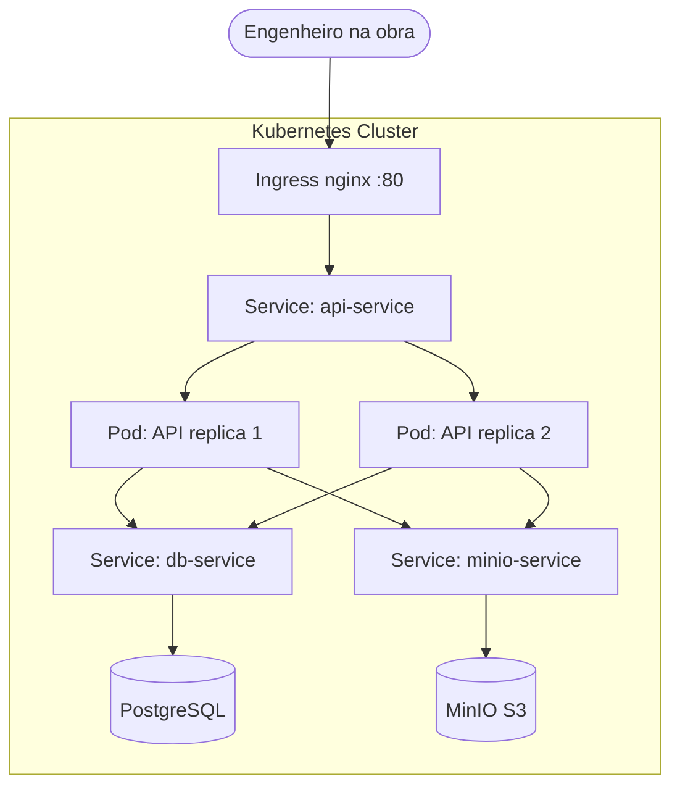
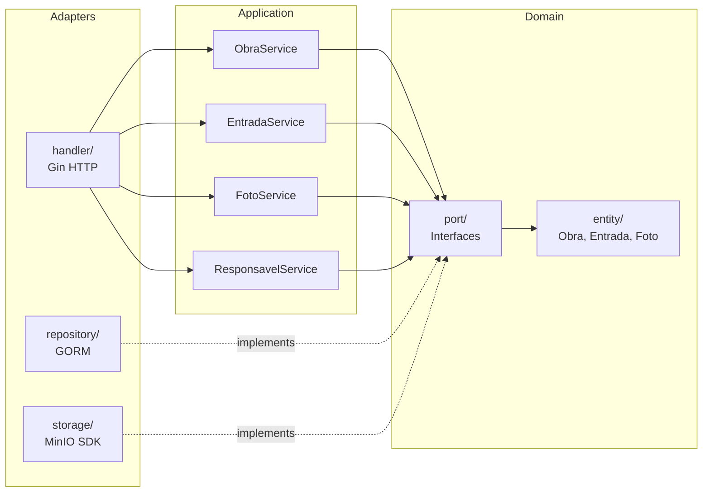
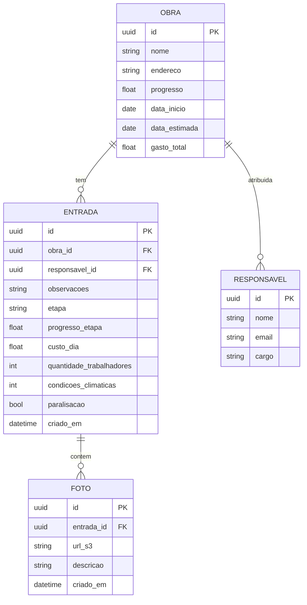

# Diário de Obra

API REST para registro digital de obras de construção civil. O engenheiro registra entradas diárias com progresso, custos, condições climáticas e fotos.

Projeto de estudo de **Go + Docker + Kubernetes** com arquitetura Ports and Adapters.

## Stack

- **Go** (Gin + GORM) — API REST
- **PostgreSQL** — Banco de dados
- **MinIO** — Object storage S3-compatible (fotos)
- **Swagger** — Documentação interativa da API
- **Prometheus** — Métricas de requisições HTTP
- **Docker** — Multi-stage build com distroless (35MB)
- **Kubernetes** — Orquestração com Kind (local)
- **Helm** — Chart para deploy em Kubernetes e OpenShift

## Arquitetura



## Arquitetura interna — Ports and Adapters



## Modelo de dados



## Endpoints

| Metodo | Rota | Descricao |
|--------|------|-----------|
| GET | `/ping` | Health check |
| GET | `/swagger/*any` | Documentacao Swagger |
| GET | `/api/v1/metrics` | Metricas Prometheus |
| | | |
| **Obras** | | |
| POST | `/api/v1/obras` | Criar obra |
| GET | `/api/v1/obras` | Listar obras |
| GET | `/api/v1/obras/:id` | Buscar obra |
| PUT | `/api/v1/obras/:id` | Atualizar obra |
| DELETE | `/api/v1/obras/:id` | Deletar obra |
| | | |
| **Entradas** | | |
| POST | `/api/v1/obras/:id/entradas` | Criar entrada |
| GET | `/api/v1/obras/:id/entradas` | Listar entradas da obra |
| GET | `/api/v1/entradas/:id` | Buscar entrada |
| DELETE | `/api/v1/entradas/:id` | Deletar entrada |
| | | |
| **Fotos** | | |
| POST | `/api/v1/entradas/:id/fotos` | Upload foto (multipart) |
| GET | `/api/v1/entradas/:id/fotos` | Listar fotos da entrada |
| DELETE | `/api/v1/entradas/:id/fotos/:fotoId` | Deletar foto |
| | | |
| **Responsaveis** | | |
| POST | `/api/v1/responsaveis` | Criar responsavel |
| GET | `/api/v1/responsaveis` | Listar responsaveis |
| GET | `/api/v1/responsaveis/:id` | Buscar responsavel |
| PUT | `/api/v1/responsaveis/:id` | Atualizar responsavel |
| DELETE | `/api/v1/responsaveis/:id` | Deletar responsavel |

## Rodando com Docker Compose

```bash
cp .env.example .env
docker compose up -d
curl http://localhost:8080/ping
```

## Rodando com Kubernetes (Kind)

```bash
# Criar cluster
kind create cluster --name diario-obra --config kind-config.yaml

# Build e carregar imagem
docker build -t diario-obras-api:latest .
kind load docker-image diario-obras-api:latest --name diario-obra

# Aplicar manifests
kubectl apply -f k8s/namespace.yaml
kubectl apply -f k8s/configmap.yaml
kubectl apply -f k8s/secret.yaml
kubectl apply -f k8s/postgres.yaml
kubectl apply -f k8s/minio.yaml
kubectl apply -f k8s/api.yaml
kubectl apply -f k8s/ingress.yaml
kubectl apply -f k8s/hpa.yaml

# Instalar Ingress controller
kubectl apply -f https://kind.sigs.k8s.io/examples/ingress/deploy-ingress-nginx.yaml

# Testar
curl http://localhost/ping
```

## Rodando com Helm

```bash
# Criar secrets (editar com credenciais reais)
cp chart/values-secrets.yaml chart/my-secrets.yaml
# editar chart/my-secrets.yaml

# Deploy local (Kind)
helm install diario-obra ./chart -n diario-obra --create-namespace -f chart/my-secrets.yaml

# Deploy OpenShift
helm install diario-obra ./chart -n diario-obra --create-namespace \
  -f chart/values-openshift.yaml \
  -f chart/my-secrets.yaml
```

## Observabilidade

O middleware Prometheus coleta automaticamente:

- `http_requests_total` — contador por metodo, rota e status
- `http_request_duration_seconds` — histograma de latencia

Endpoint de metricas: `GET /api/v1/metrics`

No Kubernetes, o `ServiceMonitor` faz scraping automatico a cada 15s para integracao com Prometheus Operator.

## Estrutura do projeto

```
├── cmd/api/main.go
├── internal/
│   ├── domain/
│   │   ├── entity/        # Obra, Entrada, Foto, Responsavel
│   │   └── port/          # Interfaces (repositories, storage)
│   ├── application/       # Services (use cases)
│   └── adapter/
│       ├── handler/       # Gin HTTP handlers + router
│       ├── repository/    # GORM implementations
│       └── storage/       # MinIO S3 implementation
├── docs/                  # Swagger (gerado pelo swag)
├── k8s/                   # Kubernetes manifests
├── chart/                 # Helm chart (Kind + OpenShift)
├── Dockerfile             # Multi-stage distroless (35MB)
├── docker-compose.yml
└── kind-config.yaml
```

## Docker — progressão de tamanho

| Imagem | Tamanho |
|--------|---------|
| golang:alpine (runtime) | ~600MB |
| Alpine multi-stage | 75MB |
| Distroless multi-stage | **35MB** |

## Roadmap

- [x] Fase 1 — Docker multi-stage + distroless
- [x] Fase 2 — MinIO upload de fotos
- [x] Fase 3 — Kubernetes com Kind
- [x] Fase 4 — Helm chart + metricas Prometheus
- [x] Fase 5 — Suporte a OpenShift
- [ ] Fase 6 — CI/CD

## Autor

Victor Gabriel — [@v1c-g4b](https://github.com/v1c-g4b)

Acompanhe a jornada no [LinkedIn](https://linkedin.com/in/v1ctorg4briel) — #buildinpublic
